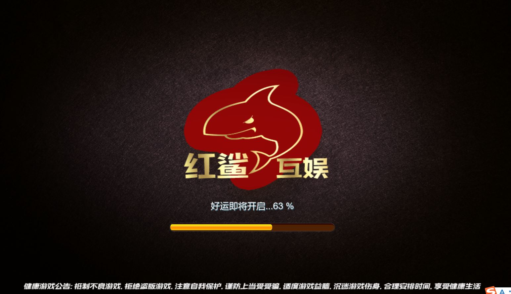
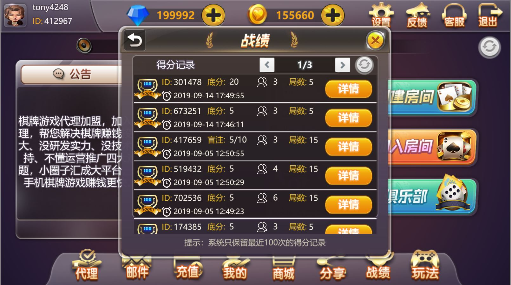
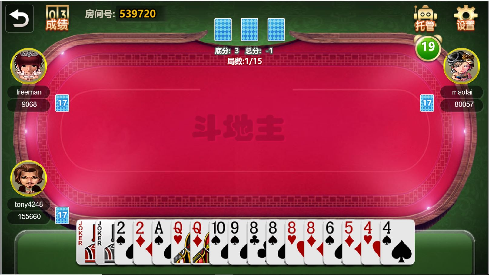
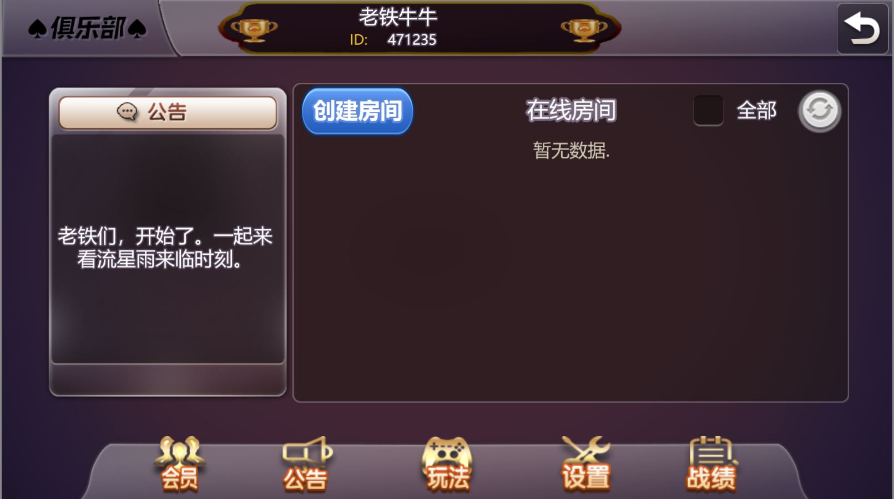
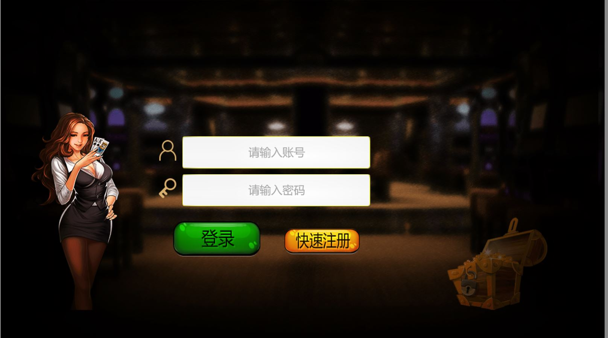

RedShark棋牌游戏客户端
=====
RedShark的客户端。采用Egret,支持金币场,房卡,俱乐部三种模式

## 重要的特点说明:
* 采用Egret开发,可以方便的发布APP和H5客户端
* 基础功能:用户管理,大厅服务,房间管理,游戏管理,商城管理,邮件管理,反馈管理,智能匹配
* 高级功能:无限极的代理管理,俱乐部功能，俱乐部有独立的积分体系

## Demo:
* 正在寻找环境

## 功能截屏

## 依赖的平台
* Egret

## 授权
	Copyright (C) 2017 QQ:1248756778
	This code is licensed under The General Public License version 3
	
## 反馈
	Your feedbacks are highly appreciated! :)
